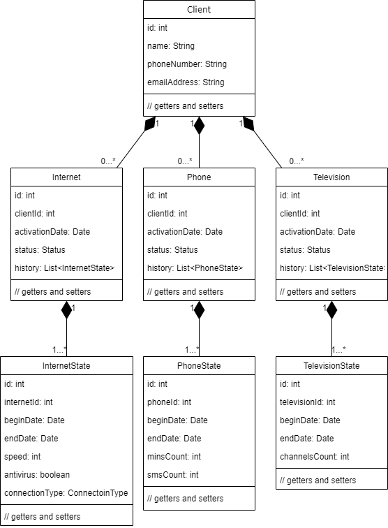
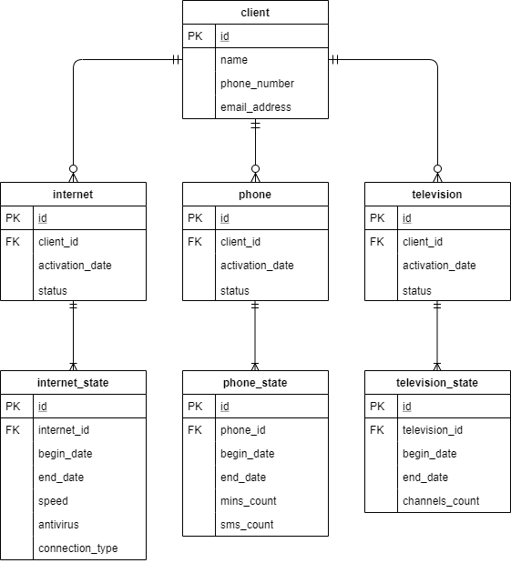

# InternetProvider
This is my Netcracker laboratory work. It is a web application, based on the model-view-controller pattern, uses the PostgreSQL DBMS, Servlets, JSP, HTML, CSS and Hibernate.

The diagram of the model:

The diagram of the database:

